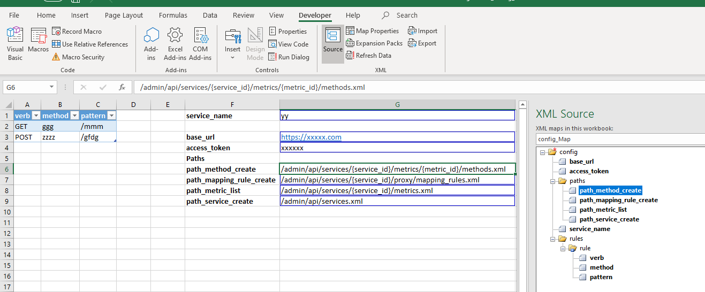

# powershell_3scale
## create api
this script create api, method, mapping rule
it use the paths node
## get api
this script will get api mapping rule, output a rules.xml
## limit api
this script will create application plan and the limit
it use limits node
## create application
this script will create application, it use the create_application.xml as config file, use the same name excel as config interface

## generate config xml excel file is used to generate the config xml file with use the excel-xml map
